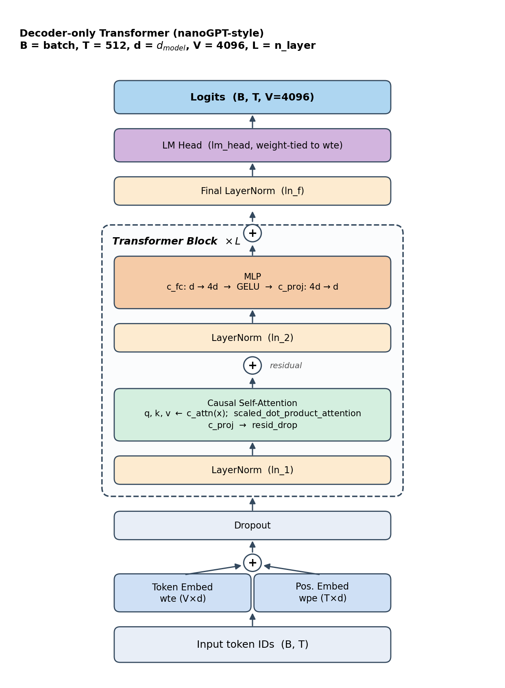
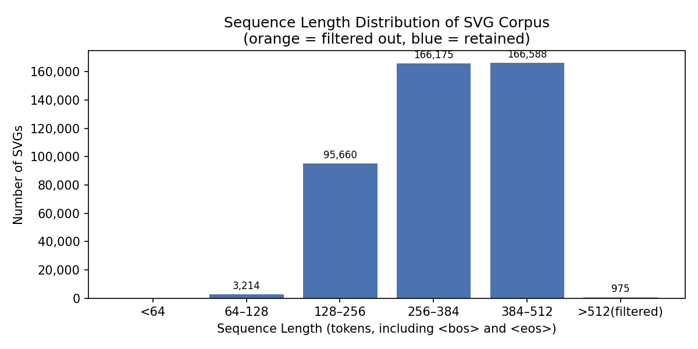
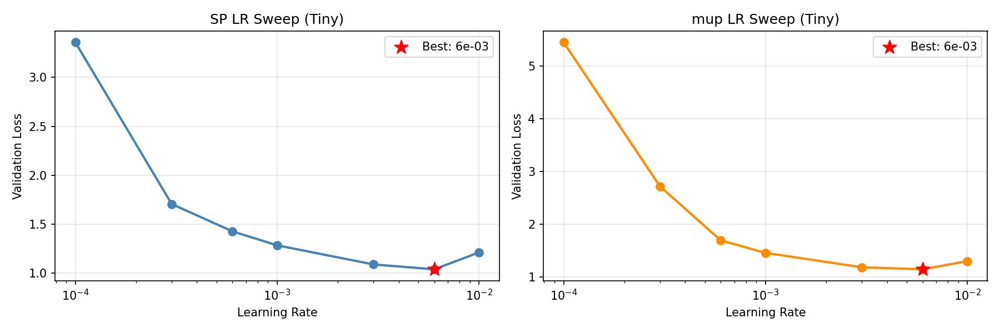
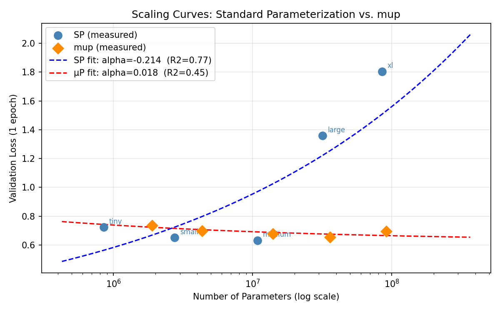
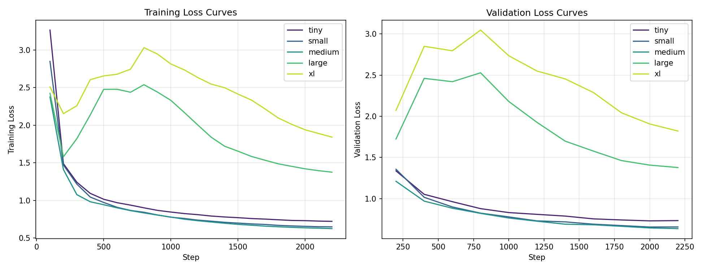
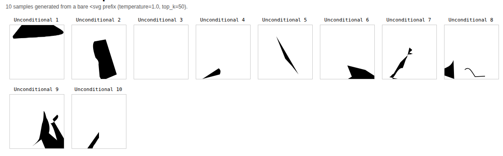

# svg-lm-scaling

**Scaling Laws for SVG Language Models**: A study of how decoder-only Transformer language models scale when trained exclusively on Scalable Vector Graphics. Covers data cleaning, BPE tokenization, five GPT-style architectures from 853K to 85.3M parameters, learning-rate sweeps, scaling-law fitting under both Standard Parameterization (SP) and Maximal Update Parameterization (mup), and a qualitative evaluation of generated SVG samples.

The full write-up with the approach, analysis, tables, and figures lives in [`Report.pdf`](./Report.pdf). This README is a summary.

> **TLDR**
> - Best validation loss: **`sp_medium` at $0.6322$ nats/token** (10.8M params, 1 epoch over 145.6M tokens).
> - SP scaling at a fixed Tiny-tuned LR is **non-monotonic** as Large and XL diverge.
> - mup with the same LR ($6{\times}10^{-3}$) is **stable at all five scales**, validating LR-transfer.
> - Generated samples are 98% XML-valid, 98% renderable, 100% use a `viewBox`.


## Model Architecture



A nanoGPT-style decoder with pre-LayerNorm, learned absolute positional embeddings, and 4&times;-expansion GELU MLP blocks. The same template is reused at every scale; only $d_{\text{model}}$, depth, and head count vary.

| Model  | $d_{\text{model}}$ | Layers | Heads | $d_h$ | Params (non-emb.) |
|--------|-------:|-------:|------:|------:|------------------:|
| Tiny   | 128 | 4  | 4  | 32 | 853,120        |
| Small  | 192 | 6  | 6  | 32 | 2,755,008   |
| Medium | 384 | 6  | 6  | 64 | 10,818,432  |
| Large  | 512 | 10 | 8  | 64 | 31,730,176  |
| XL     | 768 | 12 | 12 | 64 |  85,347,072        |

All scales share `vocab_size=4096`, `block_size=512`, and `dropout=0`. Token and output embeddings are tied (SP) or untied via `MuReadout` (mup).


## Data

Four StarVector datasets from Hugging Face (`svg-icons-simple` primary, plus `svg-emoji-simple`, `svg-stack-simple`, `svg-fonts-simple`). After aggressive cleaning (lxml strip of metadata, numeric rounding to 1 decimal, length filter $[50,8192]$ chars), tokenization with a 4096-vocabulary byte-level BPE, and a length filter of $[4,513]$ tokens, the corpus is split 98/1/1 by SVG into:

| Split      | SVGs       | Tokens         | Share |
|------------|-----------:|---------------:|------:|
| Train      | 425,063  | 145,573,946 | 98%   |
| Validation | 4,337    | 1,482,782   |  1%   |
| Test       | 4,337    | 1,474,488   |  1%   |



The token-length histogram is bimodal between 128–256 (simple icons) and 384–512 (denser glyphs). Only 975 SVGs exceed the 512-token cap and are dropped.

---

## Training Setup

| Component | Value |
|-----------|-------|
| Optimizer | AdamW ($\beta_1=0.9, \beta_2=0.95, \epsilon=10^{-8}$, wd $=0.1$) |
| Grad clip | global $\ell_2 \le 1.0$ |
| Mixed precision | bf16 autocast (fp16 + GradScaler fallback) |
| Batch size | $16 \times 8 \times 512 = 65,536$ tokens/step |
| Steps per epoch | 2,221|
| LR schedule | Cosine to $0.1\eta_{\max}$, $5\%$ warmup |
| LR sweep | 7 candidates from $10^{-4}$ to $10^{-2}$ on Tiny, 400 steps each |
| Compute | Colab Pro (T4 + A100), `torch.compile` enabled |


## Headline Results

### 1. Learning-rate sweep



Both SP and $\mu$P pick **$\eta^\star = 6\times10^{-3}$** as the optimal LR on Tiny. The transfer property only kicks in at larger widths (next plot).

| $\eta_{\max}$            | $1{\times}10^{-4}$ | $3{\times}10^{-4}$ | $6{\times}10^{-4}$ | $1{\times}10^{-3}$ | $3{\times}10^{-3}$ | **$6{\times}10^{-3}$** | $1{\times}10^{-2}$ |
|--------------------------|-------------------:|-------------------:|-------------------:|-------------------:|-------------------:|-----------------------:|-------------------:|
| SP val. loss             | 3.36 | 1.71 | 1.43 | 1.28 | 1.09 | **1.04** | 1.21 |
| $\mu$P val. loss         | 5.45 | 2.72 | 1.70 | 1.46 | 1.18 | **1.15** | 1.30 |

### 2. Transformer scaling (SP vs. $\mu$P)



Same LR, same data, same step count but different parameterization.

| Model  | Params (non-emb.) | SP val. loss | SP wall (m) | $\mu$P val. loss | $\mu$P wall (m) |
|--------|------------------:|-------------:|------------:|-----------------:|----------------:|
| Tiny   | 853,120         | 0.7226       |  24.0       | 0.7341           | 23.5  |
| Small  | 2,755,008     | 0.6502       |  49.7       | 0.6976           |  4.6  |
| Medium | 10,818,432    | **0.6322**   | 102.7       | 0.6774           |  3.9  |
| Large  | 31,730,176    | 1.3587       | 250.8       | 0.6557           |  7.2  |
| XL     | 85,347,072    | 1.8051       | 677.8       | **0.6944**       | 12.5  |

SP collapses past Medium. mup stays in a $0.65$-$0.73$ band over a ~48&times; widening.

### 3. Training curves



Tiny / Small / Medium descend smoothly under SP. Large and XL exhibit the plateau-then-spike signature of LR-induced instability.

### 4. Power-law fit and extrapolation

| Fit                       | $a$    | $\alpha$    | $R^2$ |
|---------------------------|-------:|------------:|------:|
| SP (log-log regression)   | 0.030  | $-0.214$    | 0.77  |
| Kaplan NLP reference      | --     | $\approx 0.076$ | --    |
| Chinchilla reference      | --      | $\approx 0.34$  | --     |

The fitted SP exponent is *negative* because the divergent Large/XL runs dominate the regression. Extrapolating the SP fit to $10\times$ XL yields a predicted loss of $\approx 2.47$ nats which is not a meaningful prediction so much as a quantitative summary of the collapse.


## Generated Samples

The best checkpoint by validation loss is **`sp_medium`** (10.8M params). 10 unconditional images have been created as shown below.



| Metric                              |  Value |
|-------------------------------------|-------:|
| Test perplexity                     | 1.874  |
| Test avg NLL (nats/token)           | 0.628  |
| XML validity (`lxml.fromstring`)    | 98%    |
| Render rate (`cairosvg.svg2png`)    | 98%    |
| Structural validity                 | 98%    |
| `viewBox` attribute present         | 100%   |
| Avg generated length                | 319.7 chars |

Prefix-conditioned generation (5 prompts) failed in 3/5 cases because the model was trained only on full documents wrapped with `<bos>…<eos>`. A fill-in-the-middle (FIM) training objective is the natural fix.

---

## Repository Layout

```
.
├── main.tex                              # Full report source
├── Report.pdf                            # Compiled report
├── part1_data_collection_and_preprocess/ # Dataset assembly + cleaning
├── part2_BPE_and_transformer_scaling/    # BPE training + 5-size SP scaling
├── part3_mup_and_extrapolation/          # µP scaling + power-law fit
├── part4_best_model_and_samples/         # Best-model eval + sample generation
├── drive_directories/
│   ├── results/                          # Plots, JSON results, eval metrics
│   ├── samples/                          # Generated SVGs (JSON + HTML grid)
│   └── tokenizer/                        # Trained BPE tokenizer
```

| Stage   | Notebook / Script                                  | Output                                                            |
|---------|----------------------------------------------------|-------------------------------------------------------------------|
| Stage 1 | `part1_data_collection_and_preprocess/part1.py`    | `all_svgs.jsonl`, dataset stats                                   |
| Stage 2 | `part2_BPE_and_transformer_scaling/part2.py`       | BPE tokenizer, `train/val/test.npy`, SP scaling runs              |
| Stage 3 | `part3_mup_and_extrapolation/part3.py`             | mup scaling runs, power-law fit, comparison plots              |
| Stage 4 | `part4_best_model_and_samples/part4.py`            | Generated samples, `eval_metrics.json`, `samples_grid.html`       |


## Quick Start

```bash
# 1. Open one of the part*.ipynb notebooks in Google Colab (Would recommend Colab Pro for A100 access with extended compute hours XL takes ~11h on a T4)
# 2. Each notebook mounts /content/drive/MyDrive/svg-lm-scaling/ and writes its outputs there.
# 3. Notebooks are resume-safe where incremental checkpoints are saved every 200 steps.
```

### Requirements

```
torch  numpy  scipy  matplotlib datasets  tokenizers  sentencepiece lxml  cairosvg  tqdm  mup
```


## Links

- **Checkpoints + artifacts (Drive):** <https://drive.google.com/drive/folders/1w8AvQOGDSBcUVHCp4q72n6JsDGwbbZok?usp=sharing>

## References

1. Kaplan et al. (2020). *Scaling Laws for Neural Language Models.* arXiv:2001.08361
2. Hoffmann et al. (2022). *Training Compute-Optimal Large Language Models* (Chinchilla). arXiv:2203.15556
3. Yang et al. (2022). *Tensor Programs V Tuning Large Neural Networks via Zero-Shot Hyperparameter Transfer.* arXiv:2203.03466
4. Rodriguez et al. (2023). *StarVector: Generating Scalable Vector Graphics Code from Images.* arXiv:2312.11556
5. Karpathy. *nanoGPT.* <https://github.com/karpathy/nanoGPT>
